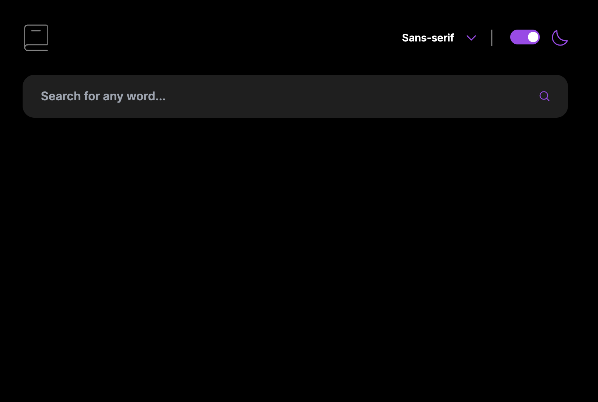
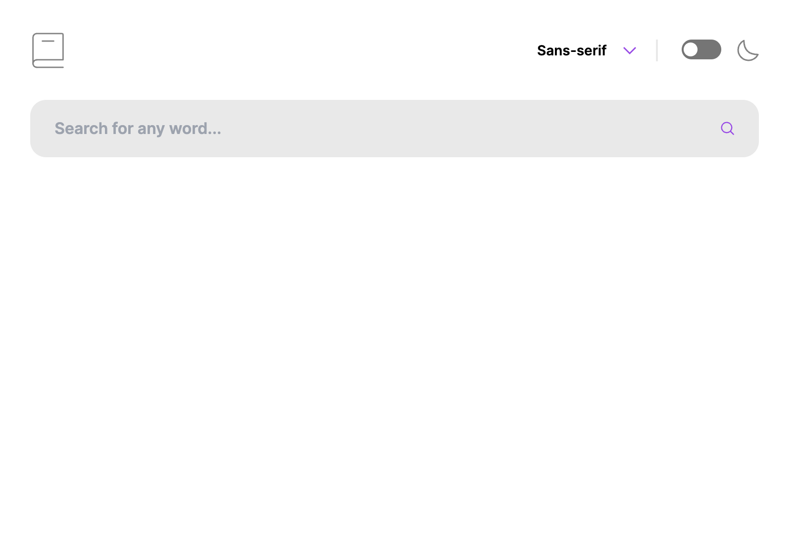
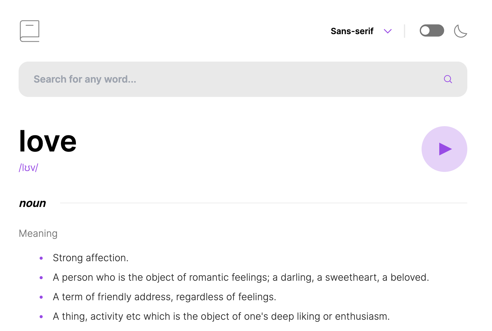
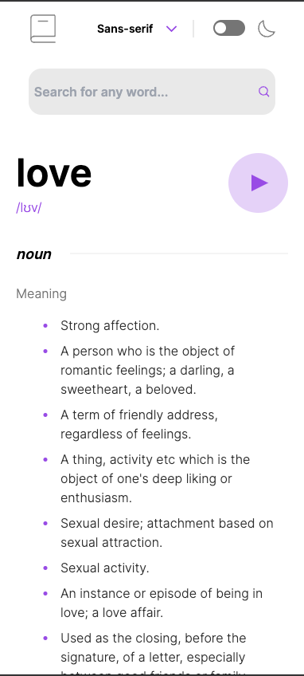

# Frontend Mentor - Dictionary web app solution

## Table of contents

- [Overview](#overview)
  - [The challenge](#the-challenge)
  - [Screenshot](#screenshot)
  - [Links](#links)
- [My process](#my-process)
  - [Built with](#built-with)
  - [What I learned](#what-i-learned)
  - [Continued development](#continued-development)
  - [Useful resources](#useful-resources)
- [Author](#author)
- [Acknowledgments](#acknowledgments)

## Overview

### The challenge

Users should be able to:

- Search for words using the input field
- See the Free Dictionary API's response for the searched word
- See a form validation message when trying to submit a blank form
- Play the audio file for a word when it's available
- Switch between serif, sans serif, and monospace fonts
- Switch between light and dark themes
- View the optimal layout for the interface depending on their device's screen size
- See hover and focus states for all interactive elements on the page
- **Bonus**: Have the correct color scheme chosen for them based on their computer preferences. _Hint_: Research `prefers-color-scheme` in CSS.

### Screenshot

### Links

- Solution URL: [Add solution URL here](https://github.com/StanishCode/dictionary-web-app)
- Live Site URL: [Add live site URL here](https://stanishcode.github.io/dictionary-web-app/)

## My process

### Built with

- Semantic HTML5 markup
- TailwindCSS
- Flexbox
- Mobile-first workflow
- [React](https://reactjs.org/) - JS library

### What I learned

I was able to learn about the window object manipulation and utilizing useEffect to extract information upon loading the web application. This project also help familiarize me more with async function and error handling api calls.

### Continued development

I will look more into advanced react hooks, like useReducer, to help reduce the amount of states in the application. Also want to look into better method of parsing api data so I can dynamically render data only if its available, mainly the audio button. Then I want to attach aync function helpers of synonyms and antonyms so I can search from related words.

## Author

- Frontend Mentor - [@yourusername](https://www.frontendmentor.io/profile/StanishCode)
